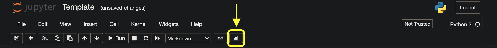

[](https://mybinder.org/v2/gh/IntelligentSystemsLaboratory/Computer-Says-I-Dont-Know/main)
[](https://IntelligentSystemsLaboratory.github.io/Computer-Says-I-Dont-Know/Template.slides.html)

# Computer Says I Don't know #

Slides for *The Turing Presents: AI UK*.

## Setup ##

Clone the repository
```bash
git clone git@github.com:IntelligentSystemsLaboratory/Computer-Says-I-Dont-Know.git
cd Computer-Says-I-Dont-Know
```

(Optionally) activate a Python virtual environment
```bash
python3.8 -m venv venv
source venv/bin/activate
```

Install the dependencies
```bash
pip install -r requirements.txt
```

Launch Jupyter Notebook (**Interactive RISE slideshow does not currently
support Jupyter Lab**)
```bash
jupyter notebook
```

## Reveal.JS Slides ##

In the Jupyter Notebook interface open the `Template.ipynb` file.
To be able to assign *slide type* to each notebook cell, enable the *Slideshow
View* in *View->Cell Toolbar->Slideshow*.

### Generating a Static Slideshow ###

Jupyter comes with a built-in command to convert a Jupyter Notebook into a
static HTML Reveal.JS slideshow
```bash
jupyter nbconvert Template.ipynb --to slides
```

### Launch Interactive Slideshow (RISE) ###

Click the *Enter/Exit RISE Slideshow* button -- the histogram icon --
to run a live slideshow.


